## 📖 개발일지


</br>
<details>
<summary>1일차_2022.05.21 (토)</summary>
<div markdown="1">
	
```
1. 기획서 작성

2. 회원가입, 로그인 UI 구현
	- 로그인 홈 화면 (100%)
	
	- 로그인 입력 화면 (80%)
		- 이메일, 비밀번호 입력하지 않으면 버튼 비활성화
	
	- 회원가입 이메일, 비밀번호 입력 화면 (80%)
		- 이메일 인증, 비밀번호 2번 입력하지 않으면 버튼 비활성화, 비밀번호 같은지 체크
	
  	- 프로필, 닉네임 입력 화면 (70%)
	  	- 닉네임 글자 수 체크
```
   
</div>
</details>

</br>
<details>
<summary>2일차_2022.05.22 (일)</summary>
<div markdown="1">

```
1. 구현한 기능
	- 카카오 로그인 구현 (100%)
	
	- TabBar 구현 (100%)
	
	- NavigationItem Custom 구현 (100%)
	
	- 맛집찾기 (100%)
		- 자동 스크롤 배너 CollectionView로 구현 
		- 식당 리스트 CollectionView로 구현 
	
2. 발생한 이슈
	- NavigationItem의 label을 줄바꿈하고, 폰트크기 다르게 구현해야함  
		- AttributedString을 사용하여 해결 (https://zeddios.tistory.com/300)

	- 맛집찾기탭에서 자동배너 뷰, 정렬,필터 뷰, 식당리스트 뷰 모두 한 스크롤안에 넣게 구현해야함  
		- CollectionView의 섹션을 3개로 잡고 각각 섹션으로 셀을 넣어줌
		- 자동배너뷰 셀안에는 CollectionView를 넣어 CollectionView안에 CollectionView로 구현 (https://youbidan-project.tistory.com/104)
	
```
  
</div>
</details>

</br>

<details>
<summary>3일차_2022.05.23 (월) - 1차 피드백</summary>
<div markdown="1">

```
1. 구현한 기능
	- 회원가입 UI (100%)
		- 텍스트필드 경고 기능 
		- 프로필 사진 설정 
	
	- 회원가입 API (100%)
	
	- 이메일 중복확인 API (100%)

2. 발생한 이슈
	- textField bottomLine이 경고창을 뜰 때 새로 그리는데 겹쳐서 그려짐  
		- self.layer.sublayers = nil 코드 추가  
	 	- 다시 그릴 때, `subLayers` 다 지우고 그림

	- 회원 가입 API
		- Response가 null로 옴 
			- 헤더에 Content-Type속성을 multipart/form-data로 넣어 해결
		- 프로필사진이 전달이 안됨 
			- jpegData(compressionQuality: 0.1)에서 compressionQuality을 1에서 0.1로 바꿔 해결

3. 기획서 변동사항
	- 이메일/비밀번호 입력 뷰, 프로필/닉네임 뷰 따로 있어서 이메일 중복확인 API 추가

4. 1차 피드백
	- 생산성 나쁘지 않음, 퍼블리싱 좋음
	- 탭바 위에 따라 오는 주황색바 구현하면 좋을 것 같음
	- 2차 피드백까지 탭바에 있는 5개 뷰 모두 구현해야 함
	- 최종적으로 최소 18~20개의 API 다뤄봐야 함
```
  	

</div>
</details>

</br>
<details>
<summary>4일차_2022.05.24 (화)</summary>
<div markdown="1">

```
1. 구현한 기능
	- 내정보 탭 UI (100%)
	- 로그인 API (100%)
	- 카카오 로그인 API (100%)

2. 발생한 이슈
	- 로그인 API 통신이 안됨
		- POST인데 명세서엔 GET으로 적혀있었음 -> 서버 개발자분께 질문해서 해결
	
	- 내정보의 타임라인 셀만 모양이 다름
		- 가고싶다, 마이리스트 .. 와 다른 섹션으로 넣은 뒤, footer의 height를 조절하여 같은 섹션처럼 보이게 구현

3. API 변동사항
	- API 구현 순서 변경 요청
		- 로그인하고 가장 먼저 보이는 부분이 탭바이기 때문에   
		  팔로워, 팔로잉 API 우선순위를 미루고 맛집찾기 API, 망고픽 API 먼저 구현해달라고 요청함

```
 

</div>
</details>


</br>
<details>
<summary>5일차_2022.05.25 (수)</summary>
<div markdown="1">

```
1. 구현한 기능
	- 탭바 위에 주황 바가 따라다니는 커스텀 탭바 구현(1차 피드백 요구사항) (100%)
	- 내정보 - 설정 UI (100%)
	- 망고픽 - EAT딜 UI (100%)
	- 망고픽 - 스토리 UI (100%)
	- 망고픽 - Top리스트 UI (100%)

2. 발생한 이슈
	- 주황색 뷰가 따라다니는 커스텀 탭바 구현
		- Tabman 라이브러리의 LineBar 사용
	
	- 커스텀 탭바라 hidesBottomBarWhenPushed가 동작하지 않음
		- BaseTabBarController에 탭바를 static으로 선언해 외부에서 접근하여 hide할 수 있게 구현
	
	- ImageView의 이미지가 밝은 경우, 위에 올린 흰색 글씨가 보이지 않음
		- ImageView밑에 검정 UIView를 깔고 ImageView에 alpha를 조절하여 어둡게 바꿈

```
 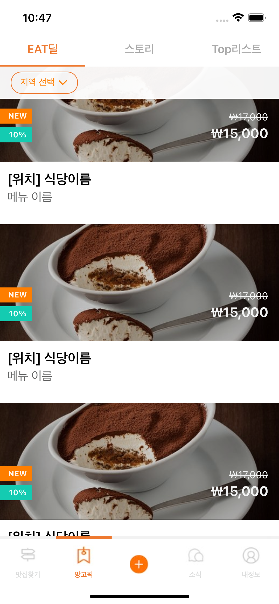  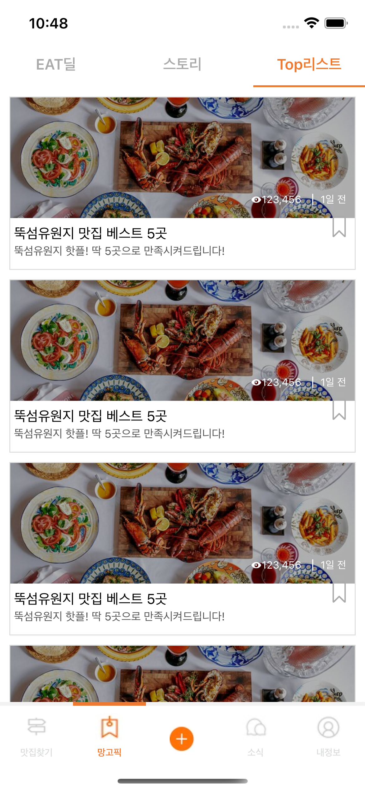 

</div>
</details>
</br>
<details>
<summary>6일차_2022.05.26 (목) - 위클리스크럼 </summary>
<div markdown="1">

```
1. 구현한 기능
	- 회원 탈퇴 UI (100%)
	- 회원 탈퇴 API (100%)


2. 발생한 이슈
	- navigaionItem에 있는 Button에 클릭 이벤트를 넣고 싶음
		- 파라미터로 Selector를 넘겨 addTarget함
	
	- 지역선택 뷰 overCurrentContext로 넘겨줘도 밑에 뷰가 투명하게 보이지 않음
		- 미해결🥲

	- 회원탈퇴 시, 약관 동의가 모두 되었는지 확인
		- allSatisfy({$0 == true}) 사용 

	- 회원탈퇴 API에서  "유저 ID 정보를 찾을 수 없습니다." 라는 메세지만 뜸
		- 서버 개발자분께 전달해 수정해주심 (userId가 토큰에 안담겨 있었다고 함)


3. 위클리 스크럼 진행

	- 현재 만든 UI(로그인/회원가입 UI, 맛집찾기 탭, 망고픽 탭, 내정보 탭) 와 
		연동한 API(이메일 로그인/카카오 로그인/회원가입/이메일 중복확인 API) 시뮬레이터로 실행해서 공유 

	- 평점은 별로/괜찮다/맛있다를 각각 1,2,3점씩 계산하여 5점으로 변환했다고 하심

	- <요청> 탭바 API 부분 먼저 만들어 달라고 요청

	- <요청> 내정보와 회원탈퇴 뷰에서 닉네임과 프로필을 보여줘야해서 회원 정보 API 만들어달라 요청

	- <질문> 회원가입할 때, 이미지를 닉네임.jpg로 보냈는데 괜찮은지?
		-> 서버에서 이미지 이름을 중복되지 않게 처리하기 때문에 상관없음

	- <질문> 회원 탈퇴 시, 유저아이디를 따로 안보내고 jwt토큰만 보내는데 어떻게 동작하는지 궁금
		-> JWT을 만들 때, 유저 식별자를 담아서 암호화 함
		   그래서 서버가 암호화한 토큰을 복호화해서 유저 식별자를 꺼내 탈퇴 진행!


	

```
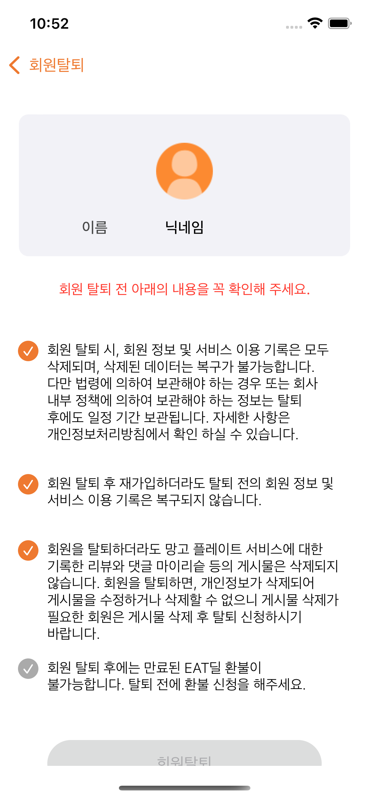

</div>
</details>

</br>
<details>
<summary>7일차_2022.05.27 (금)</summary>
<div markdown="1">

```
1. 구현한 기능
	- 내 위치 UI & 기능 구현(80%) 
	- plus탭 애니메이션 구현 (100%)

2. 발생한 이슈
	- 서버가 4회 이상 끊김
		- 서버 개발자분이 계속 재시작 해주셨지만 자꾸 끊겨 API 연동은 포기하고 UI 구현

	- half 모달
		- 반은 투명한 버튼, 반은 uiView로 구성

	- half 모달 안에 탭바를 넣어야 함
		- VC안에 child로 VC만듦 (https://hyunsikwon.github.io/ios/iOS-ChildViewControllers/)

	- 지역선택뷰는 VC -> half VC -> tabBar VC -> Cell 형태라 매우 복잡한 구조로 되어 있어 데이터 전달에 어려움 겪음
		- NotificationCenter 사용해 데이터 전달 
		- 지역선택 뷰가 복잡해서 지역 조회 API 연동 우선순위 미룸

	- plus탭을 누르면 페이지 이동은 하지 않고 VC를 present하며 circle애니메이션 동작
		- PageboyViewControllerDataSource에서 2번째 탭은 nil리턴
		- circle 애니메이션 참고 (https://www.youtube.com/watch?v=B9sH_VxPPo4)


```
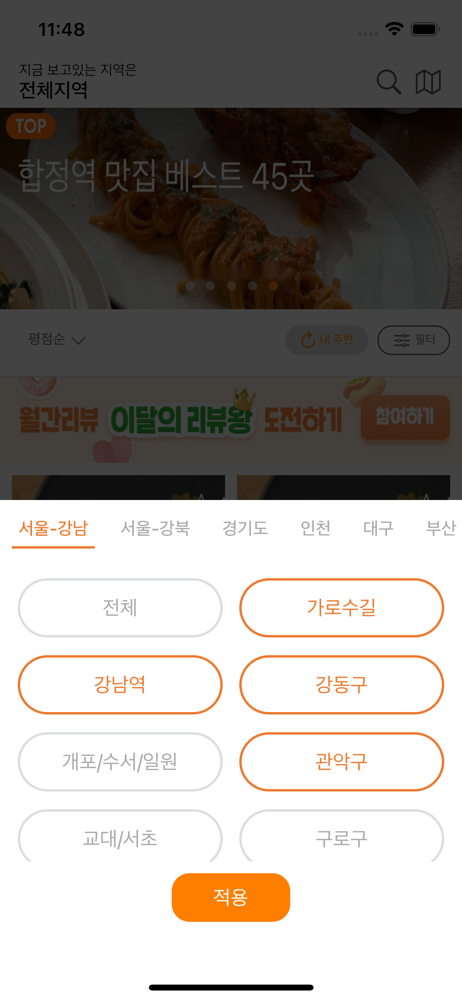 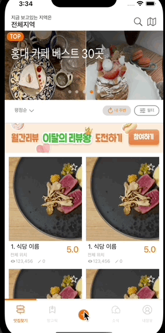 

</div>
</details>


</br>
<details>
<summary>8일차_2022.05.28 (토)</summary>
<div markdown="1">

```
1. 구현한 기능
	- 위치동의 UI & 현재 위치 가져오기 (100%)
	- 맛집찾기 - 식당목록 조회 API (80%) (지역별로 조회 구현 예정)
	- 망고픽 - EAT딜 조회 API (100%)
	- 망고픽 - 스토리 조회 API (100%)
	- 망고픽 - Top리스트 조회 API (100%)
	- 내정보 - 회원 조회 API (100%)

2. 발생한 이슈

	- 어제 발생 했던 서버 끊김 현상, 서버 개발자분이 지역 조회 API를 만들 때 DB서버랑 연결을 해제를 제대로 안해줘서 생긴 문제라고 함
		-> 해결!
	
	- 회원 조회 API는 내정보뷰와 탈퇴뷰에서 둘 다 씀
		-> API를 호출하는 VC의 타입을 UIViewController로 두고 타입 체크를 해서 각각 API 성공함수 호출함

	- 망고픽 - 스토리탭에서 홀릭픽 마크가 가운데 정렬이 안됨
		-> 서버에서 주는 이미지를 보니 가로로 긴데 스토리 셀은 정사각형이라 비율이 안맞아서 문제
		-> 급한건 아니니 시간날 때 수정해달라고 서버 개발자분에게 요청

	- 식당 셀의 글씨가 길어서 평점을 밀려 셀이 나오지 않음
		-> 평점의 Compression Resistance priority를 높여줘서 해결


3. API 변동사항

	- 식당 조회 API에 조회수 정보 요구 -> 바로 추가해주심!
	- Top리스트 조회 API 날짜 정보 요구 -> 바로 추가


```
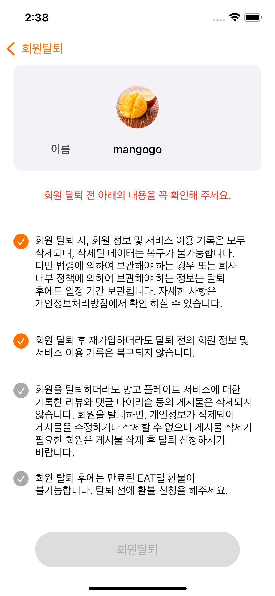 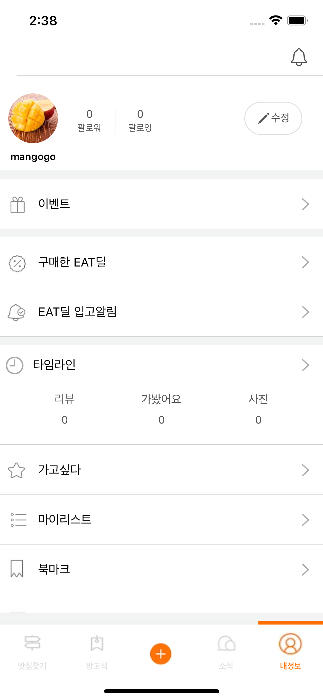 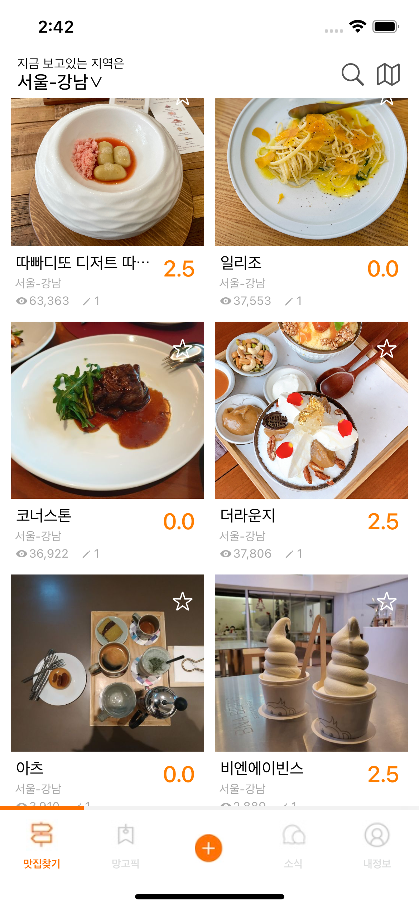 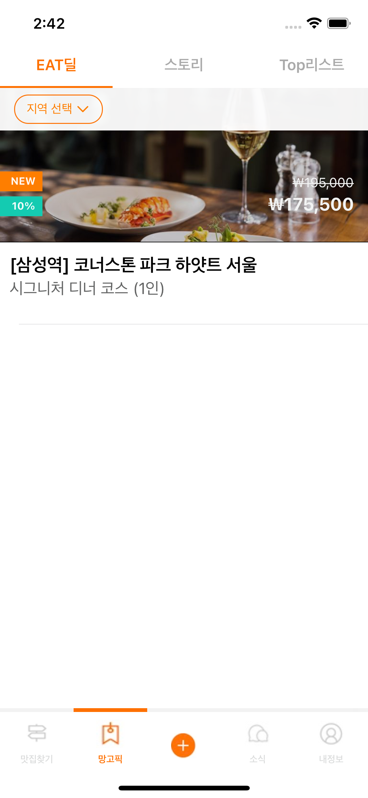 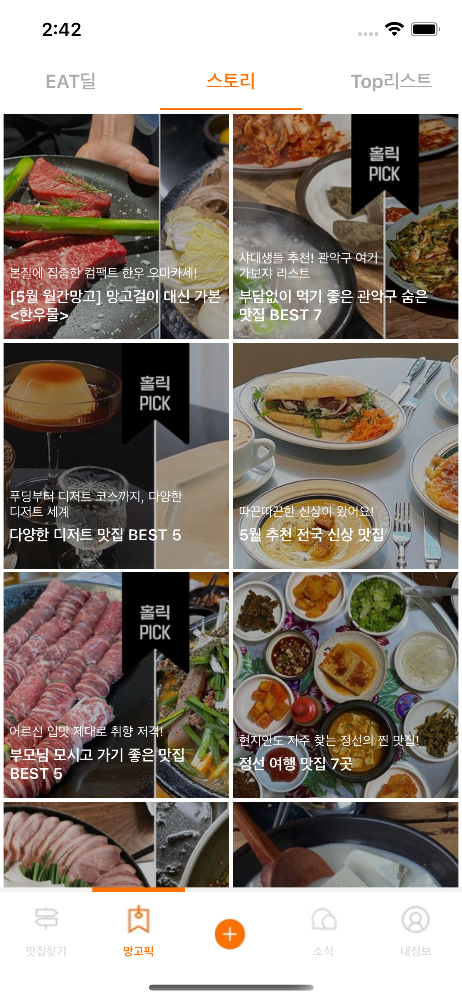 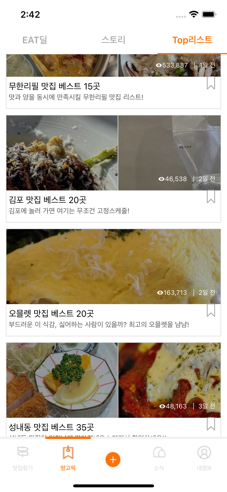 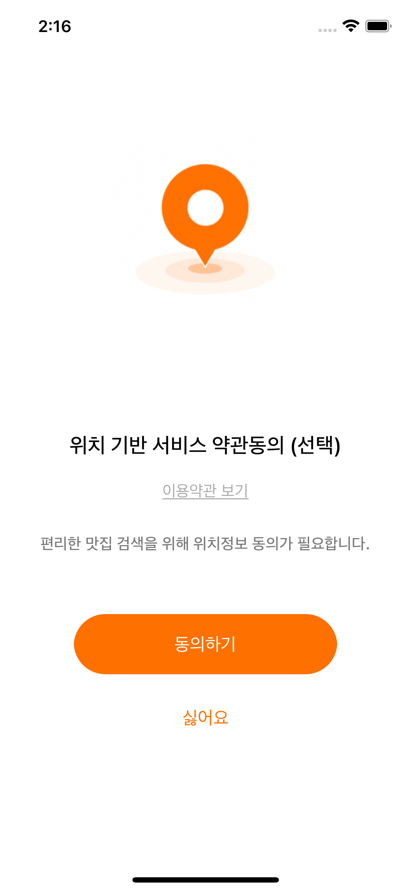 

</div>
</details>


</br>
<details>
<summary>9일차_2022.05.29 (일)</summary>
<div markdown="1">

```
1. 구현한 기능
	- 소식탭 UI (90%) (소식-홀릭 탭의 홀릭 설명 추가 예정)
	- 식당 상세 정보 UI (50%) (현재 식당 사진, 정보, 메뉴 구현)
	- 맛집찾기 - 선택한 지역으로 식당 검색 기능 (100%)
	- 맛집찾기 - 현재 내위치와 식당과의 거리 (100%) 

2. 발생한 이슈

	- 지역선택뷰에서 선택한 지역을 맛집찾기뷰에 보내줘야 함
		- delgate패턴으로 구현 : 지역선택뷰가 탭맨이 있어서 뷰안에 뷰가 있는 구조라 vc.delgate = self 가 안됨 -> 실패
		- NotificationCenter 사용해서 object로 선택 지역 정보를 전달해 구현

	- 소식탭의 게시글 속 사진, 식당 상세 정보의 식당 사진과 메뉴 사진
		- collectionView cell 안에 collectionView를 넣어서 구현


3. API 변동사항

	- 소식탭 관련 리뷰 조회 API 먼저 구현 요구
	- 리뷰 조회 API는 지역별 조회말고 평가별 조회(맛있다/괜찮다/별로) 구현 요구


```
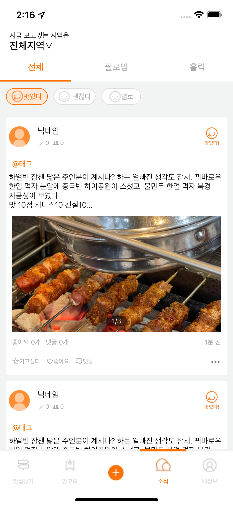 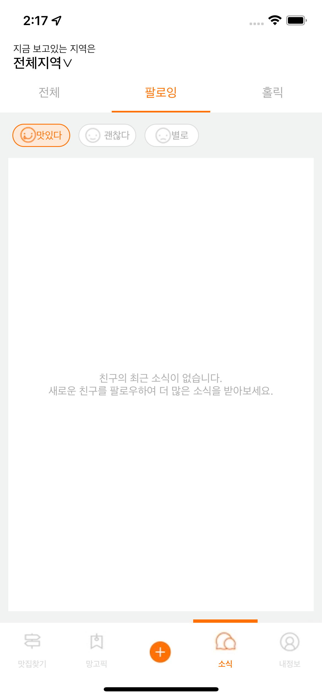 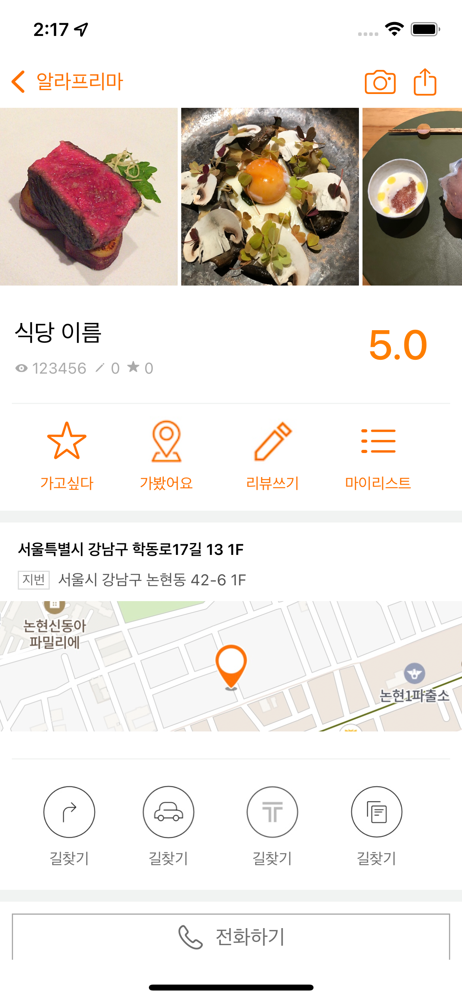 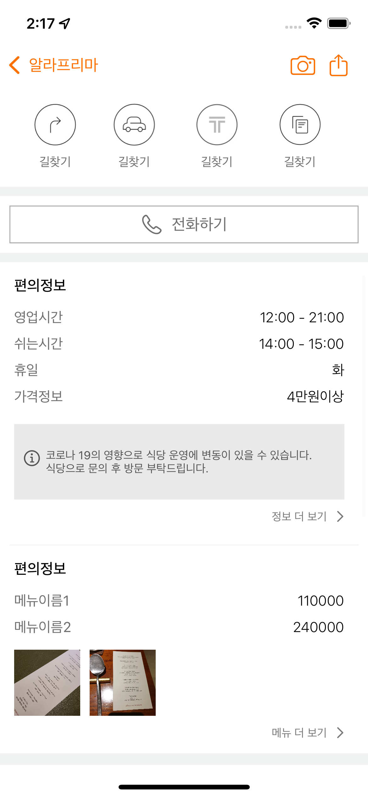

</div>
</details>


</br>
<details>
<summary>10일차_2022.05.30 (월)</summary>
<div markdown="1">

```
1. 구현한 기능

	- 소식 - 피드 조회 API : 평가별로 조회 가능 (95%) (식당이름만 서버에서 보내주는걸로 API 수정하면 됨)
	- 식당 상세 - 리뷰, 관련 Top리스트, 스토리, 주변 식당 셀 (100%)
	- plus탭 - 누르면 버튼들 페이드인 애니메이션 (100%)
	- plus탭 - 리뷰 쓰기 식당 목록 UI (100%)
	- 맛집 찾기 - 정렬 선택 UI (100%)
	

2. 발생한 이슈

	- 소식탭에 cell안에 있는 맛있다/괜찮다/별로 버튼의 이벤트를 처리해줘야함

    	- NotificationCenter : 버튼의 backgorundColor, borderColor,  이미지, tintColor 모두 변경해줘야하는데 
		버튼 클릭 시, 실행할 함수는 sender를 UIButton 이 아니라 
		Notification으로 받기 때문에 구현하기 힘들다고 판단 -> 사용x

    	- Delegate 패턴 :  파라미터로 UIButton을 보내주며 프로토콜 채택한 함수내에서  버튼 UI 처리 -> 해결


	- 상세지역 검색하면 전체지역으로 나옴 

		- 처음엔 데이터가 잘못된 줄 알았으나 API명세서를 잘못 이해 (강남에서 가로수길만 검색하고 싶으면 detailarea만 보내는건데 area도 같이 보냄)
		- 서버 개발자분께 질문해 해결


3. API 변동사항

	- 피드 조회 API에서 식당이름, 위치 추가 요구
	

4. 서버 개발자와의 회의
	기간이 얼마 남지 않아 아래 3가지로 개발 범위 정함

		1. 맛집 상세 정보 조회 
    		- 지도는 이미지로 대체


		2. 리뷰 쓰기 기능
 			- 리뷰쓸 때 식당을 선택해야 돼서 모든 식당 목록 조회 API 추가 (식당 검색은 구현안하고 모든 식당에서 선택하는걸로 구현예정) 

		3. 가고싶다 등록 기능


```
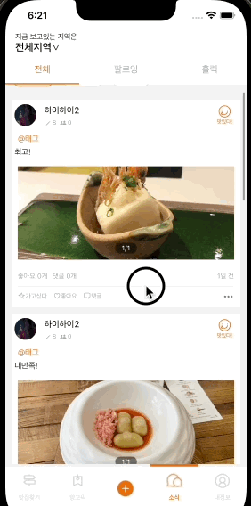 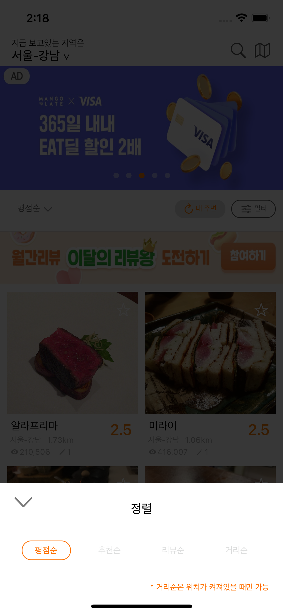 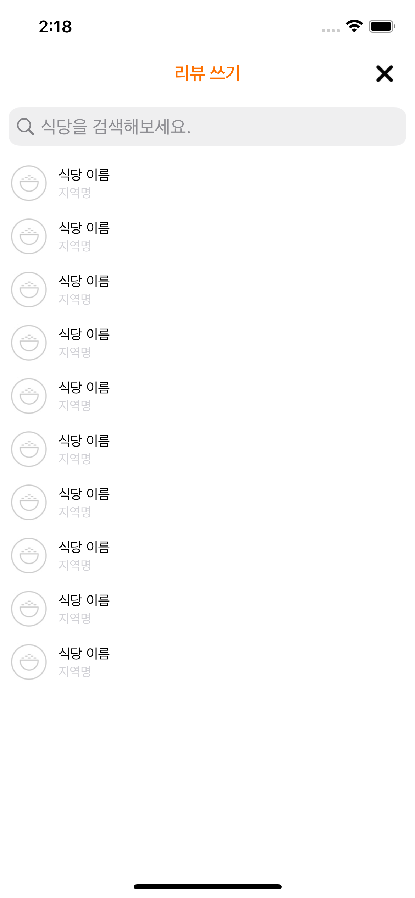 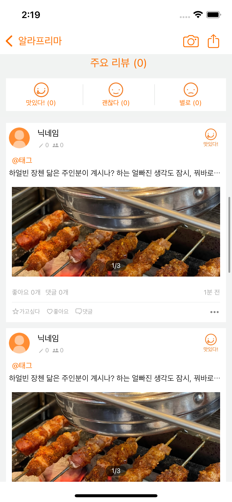 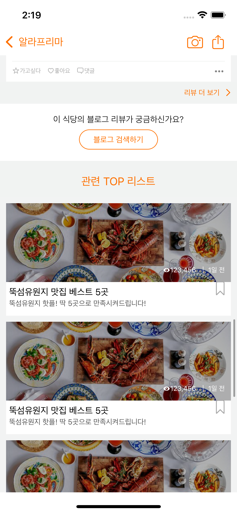 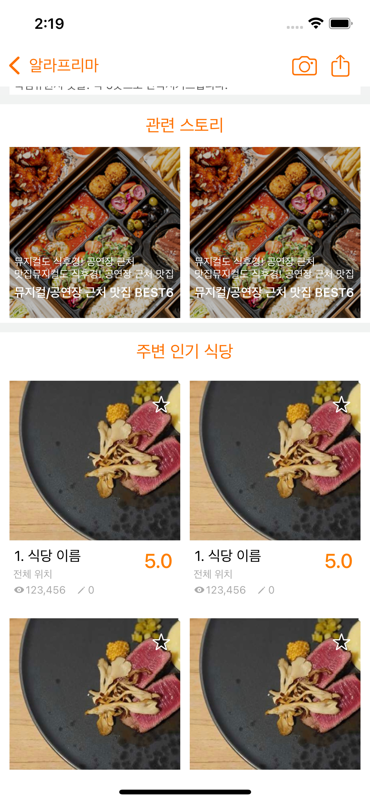

</div>
</details>


</br>
<details>
<summary>11일차_2022.05.31 (화) - 2차 피드백 </summary>
<div markdown="1">

```
1. 구현한 기능

	- 리뷰 쓰기 - 식당 검색 API (100%)
	- 리뷰 쓰기 - 커스텀 갤러리에서 사진 선택 (100%)
	- 리뷰 쓰기 - 리뷰 작성 UI (100%)
	- 로그인 여부에 따라 마이페이지 화면 다르게 보여주기 (100%)
	- 맛집 상세 - 기존에 있던 API에서 갯수만 선택해서 불러와 상세 페이지의 관련 Top리스트, 관련 스토리, 주변 인기 식당 구현 (100%) 
	

2. 발생한 이슈

	- 리뷰 쓰기에서 갤러리에 있는 사진을 커스텀으로 꾸며야함

    	- 갤러리에 있는 모든 이미지를 PHFetchResult로 받아 UIImage로 변환해서 collectionView의 셀로 넣어주며 구현
             갤러리 이미지 콜렉션뷰로 받기 참고 (https://fomaios.tistory.com/entry/%EC%BB%A4%EC%8A%A4%ED%85%80-%EC%9D%B4%EB%AF%B8%EC%A7%80%ED%94%BD%EC%BB%A4-%EB%B0%8F-%EB%A9%80%ED%8B%B0%ED%94%BDCustom-ImagePicker-and-MultiPick)

   		 - PHAsset을 UIImage로 변환 참고 (https://fomaios.tistory.com/entry/%EC%BB%A4%EC%8A%A4%ED%85%80-%EC%9D%B4%EB%AF%B8%EC%A7%80%ED%94%BD%EC%BB%A4-%EB%B0%8F-%EB%A9%80%ED%8B%B0%ED%94%BDCustom-ImagePicker-and-MultiPick)


	- 피드 셀안에 있는 좋아요 버튼을 누르면 해당 피드 index를 알아야함
		- NotificationCenter를 쓰려 했으나 좋아요 버튼이 있는 셀에선 자기가 몇번째 셀인지를 모름 -> 아직 고민중


4. 서버 개발자와의 회의

		1. 식당 정보 조회 API
		2. 리뷰 작성 API
		3. 게시글 좋아요 API
		4. 가고싶다 등록 API
		5. 가고싶다 삭제 API
		6. 배너 이미지 API
		7. 리뷰 상세 정보 조회 API
	
		위 순서대로 개발하기로 함


5. 2차 피드백
	- 지금까지 사용한 API가 12개인데 최소 18개까지 사용하면 우수수료 가능할 것 같다고 하심
	- 지금처럼만 하면 될 것 같다고 피드백해주심


```
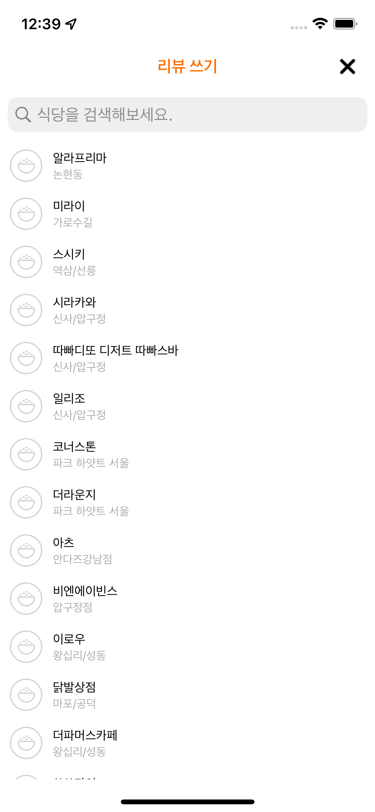 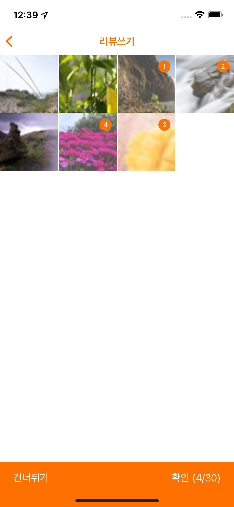 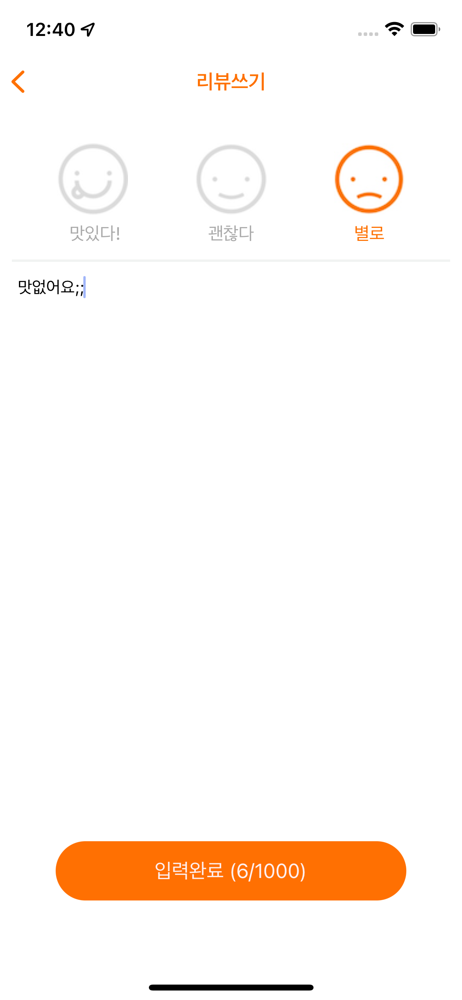 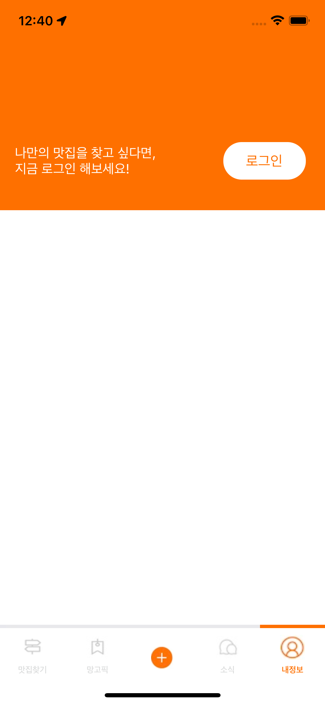 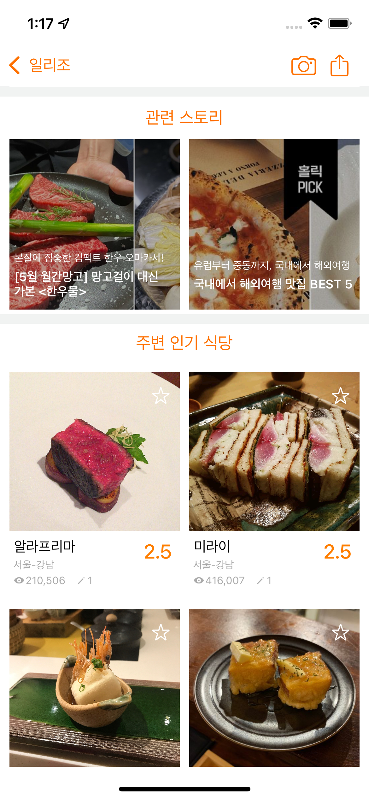 

</div>
</details>


</br>
<details>
<summary>12일차_2022.06.01 (수)  </summary>
<div markdown="1">

```
1. 구현한 기능

	- 식당 상세 정보 API (100%)
	- 내정보 - 내 리뷰 UI (100%)
	- 리뷰 조회 API - 평가별로 필터링 가능! (100%)
	- 리뷰 작성 API (100%)
	- 리뷰 삭제 API (100%)
	- 게시글 좋아요 API (100%)
	

2. 발생한 이슈

	- 리뷰 등록한 사진 화질이 너무 안좋음
 			- PHAsset을 UIImage로 바꾸는 코드에서 options.isSynchronous = true 을 추가해서 해결


	- 피드 셀안에 있는 좋아요 버튼을 누르면 해당 피드 postId를 알아야함 -> 어제 이슈 해결!
			- cell 내부에 postId 프로퍼티를 선언해 cell마다 자신의 postId 저장해놓음
	
	
	- 리뷰 삭제하기 누르면 리뷰목록 collectionView에서 reload하며 리뷰를 다시 불러와야함 
			- viewWillAppear는 호출이 안되기 때문에 NotificationCenter달아서 삭제된 순간에 reload함


	- 리뷰 삭제 API에서 분명히 body 를 담아서 보냈는데 body가 없다고 뜸
			- 종종 delete 요청에서 body를 담아 보내면 서버에서 이를 거절한다함 (처음 안 사실..)
			- 서버 개발자분이 path variable 형태로 API를 수정해 해결
			
			
	- 좋아요 버튼 클릭하면 리뷰 목록 다시 불러와야함
			- NotificationCenter로 좋아요 버튼 눌렀다는걸 알리고 그때 피드 collectionView reload시킴

	- 게시글 좋아요가 됐다가 안됐다함
			- 좋아요를 누르고 다시 리뷰를 reload하는데 좋아요가 적용되기 전에 너무 빨리 불러와서 됐다가 안됐다가 한 것
 			- usleep으로 0.02초 딜레이를 줘서 해결


4. API 변동사항
	- 회원 정보 조회 API에 내 리뷰 개수, 가고싶다 개수 받을 수 있게 추가
	- 리뷰 삭제 API body대신 path variable 형태로 수정
	- 피드 조회 API 태그값 받을 수 있게 추가


```
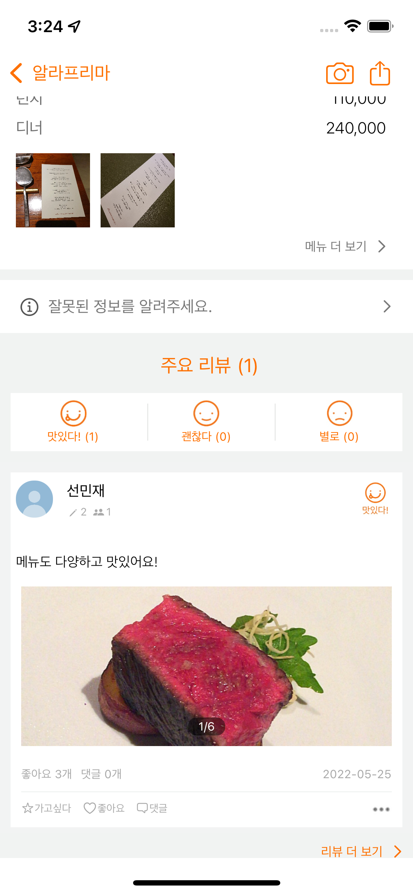 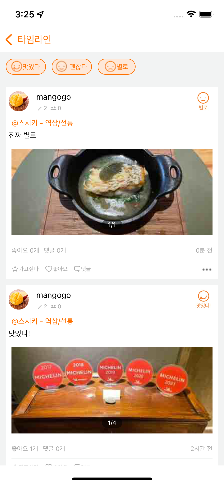  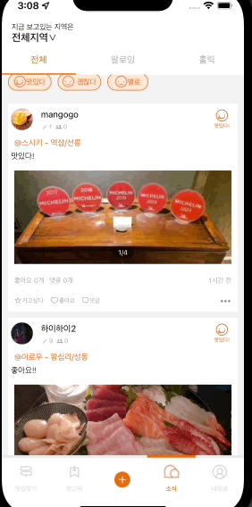 

</div>
</details>


</br>
<details>
<summary>13일차_2022.06.02 (목)  </summary>
<div markdown="1">

```
1. 구현한 기능

	- 식당 가고싶다 등록 API (100%)
	- 광고 배너 API (100%)
	- 내정보 - 가고싶다 목록 UI (100%)
	- 가고싶다 조회 API (100%)
	

2. 발생한 이슈

	- API로 사진을 받아오면 스크롤이 버벅거림

		- 셀 처리부분에서 셀마다 Url을 이미지로 변환해서 그때그떄 변환해주는 코드에서
							url을 받으면 한번에 이미지로 변환하는 것으로 수정해 해결


	- 마이페이지에 가고싶다 셀만 개수 표시하는데 구매한 EAT딜에도 같은 개수가 뜸
		- 셀의 재사용때문, prepareForReuse()에서 개수 label의 텍스트를 빈칸으로 두어 해결


4. API 변동사항
	- 회원 조회 API: 가고싶다 개수 추가
	- 식당 목록 조회 API: 로그인한 사용자의 가고싶다 클릭 여부 추가


```
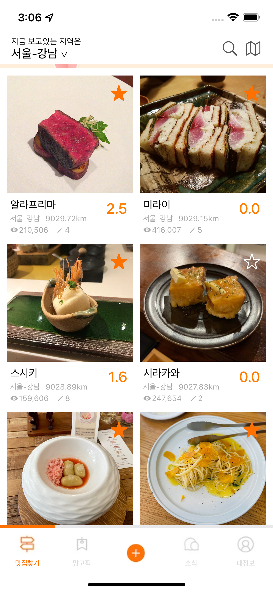 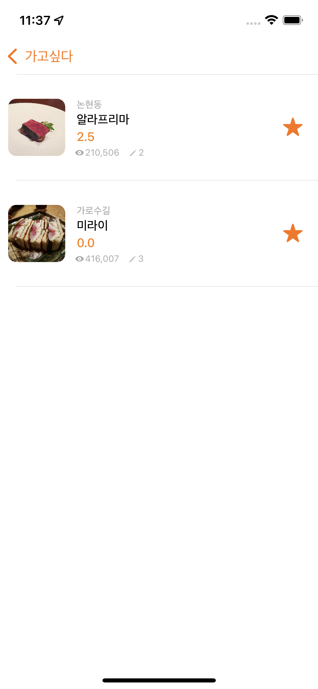 <

</div>
</details>


