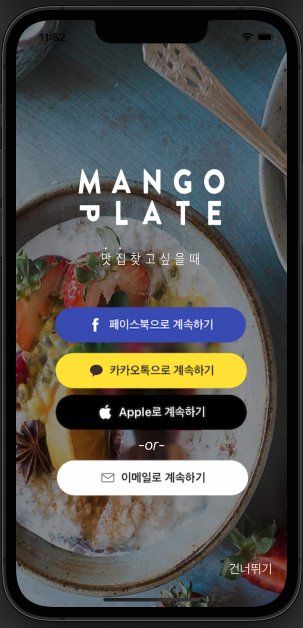
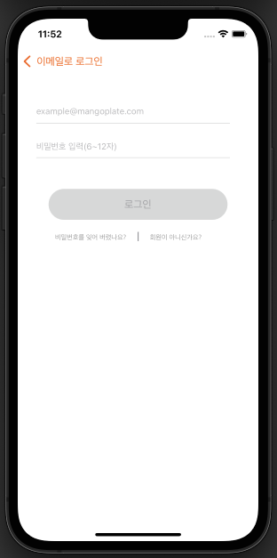
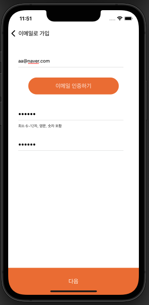
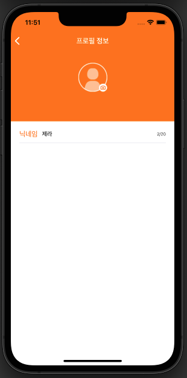
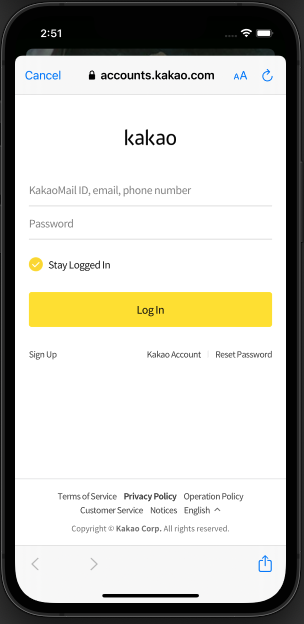
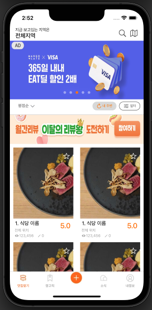
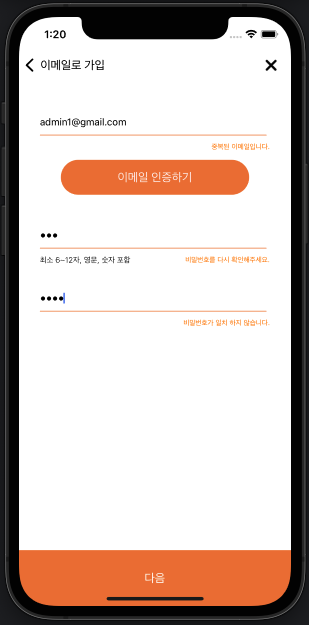
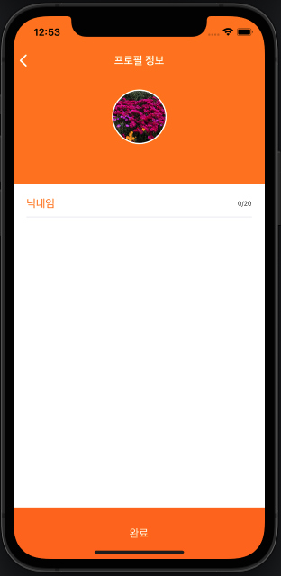

## 📖 개발일지
 

1일차_2022.05.21 (토)

1. 기획서 작성

2. 회원가입, 로그인 UI 구현
	- 로그인 홈 화면 (100%)
	- 로그인 입력 화면 (80%)
		- 이메일, 비밀번호 입력하지 않으면 버튼 비활성화
	- 회원가입 이메일, 비밀번호 입력 화면 (80%)
		- 이메일 인증, 비밀번호 2번 입력하지 않으면 버튼 비활성화, 비밀번호 같은지 체크
  	- 프로필, 닉네임 입력 화면 (70%)
	  	- 닉네임 글자 수 체크

   

 

2일차_2022.05.22 (일)

1. 구현한 기능
	- 카카오 로그인 구현 (100%)
	- TabBar 구현 (100%)
	- NavigationItem Custom 구현 (100%)
	- 맛집찾기 (100%)
		- 자동 스크롤 배너 CollectionView로 구현 
		- 식당 리스트 CollectionView로 구현 
2. 발생한 이슈
	- NavigationItem의 label을 줄바꿈하고, 폰트크기 다르게 구현해야함  
		- AttributedString을 사용하여 해결 ([참고](https://zeddios.tistory.com/300))

	- 맛집찾기탭에서 자동배너 뷰, 정렬,필터 뷰, 식당리스트 뷰 모두 한 스크롤안에 넣게 구현해야함  
		- CollectionView의 섹션을 3개로 잡고 각각 섹션으로 셀을 넣어줌 
			자동배너뷰 셀안에는 CollectionView를 넣어 CollectionView안에 CollectionView로 구현 ([참고](https://youbidan-project.tistory.com/104))

  

 

3일차_2022.05.23 (월) - 1차 피드백

1. 구현한 기능
	- 회원가입 UI (100%)
		- 텍스트필드 경고 기능 
		- 프로필 사진 설정 
	- 회원가입 API (100%)
	- 이메일 중복확인 API (100%)
	  

2. 발생한 이슈
	- textField bottomLine이 경고창을 뜰 때 새로 그리는데 겹쳐서 그려짐  
		- `self.layer.sublayers = nil` 코드 추가  
	 	- 다시 그릴 때, `subLayers` 다 지우고 그림

	- 회원 가입 API
		- `Response`가 `null`로 옴 
			- 헤더에 `Content-Type` 속성을 `multipart/form-data`로 넣어 해결
		- 프로필사진이 전달이 안됨 
			- `let profileData = profile.jpegData(compressionQuality: 0.1)` 에서 `compressionQuality`을 1에서 0.1로 바꿔 해결

3. 기획서 변동사항
	- 이메일/비밀번호 입력 뷰, 프로필/닉네임 뷰 따로 있어서 이메일 중복확인 API 추가

4. 1차 피드백
	- 생산성 나쁘지 않음, 퍼블리싱 좋음
	- 탭바 위에 따라 오는 주황색바 구현하면 좋을 것 같음
	- 2차 피드백까지 탭바에 있는 5개 뷰 모두 구현해야 함
	- 최종적으로 최소 18~20개의 API 다뤄봐야 함

