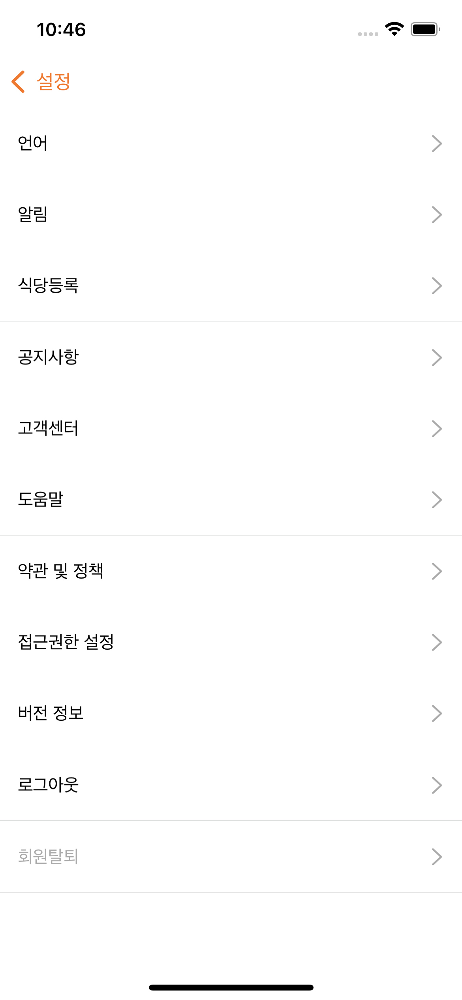

## 📖 개발일지
</br>
<details>
<summary>1일차_2022.05.21 (토)</summary>
<div markdown="1">
	
```
1. 기획서 작성

2. 회원가입, 로그인 UI 구현
	- 로그인 홈 화면 (100%)
	
	- 로그인 입력 화면 (80%)
		- 이메일, 비밀번호 입력하지 않으면 버튼 비활성화
	
	- 회원가입 이메일, 비밀번호 입력 화면 (80%)
		- 이메일 인증, 비밀번호 2번 입력하지 않으면 버튼 비활성화, 비밀번호 같은지 체크
	
  	- 프로필, 닉네임 입력 화면 (70%)
	  	- 닉네임 글자 수 체크
```
   
</div>
</details>

</br>
<details>
<summary>2일차_2022.05.22 (일)</summary>
<div markdown="1">

```
1. 구현한 기능
	- 카카오 로그인 구현 (100%)
	
	- TabBar 구현 (100%)
	
	- NavigationItem Custom 구현 (100%)
	
	- 맛집찾기 (100%)
		- 자동 스크롤 배너 CollectionView로 구현 
		- 식당 리스트 CollectionView로 구현 
	
2. 발생한 이슈
	- NavigationItem의 label을 줄바꿈하고, 폰트크기 다르게 구현해야함  
		- AttributedString을 사용하여 해결 (https://zeddios.tistory.com/300)

	- 맛집찾기탭에서 자동배너 뷰, 정렬,필터 뷰, 식당리스트 뷰 모두 한 스크롤안에 넣게 구현해야함  
		- CollectionView의 섹션을 3개로 잡고 각각 섹션으로 셀을 넣어줌
		- 자동배너뷰 셀안에는 CollectionView를 넣어 CollectionView안에 CollectionView로 구현 (https://youbidan-project.tistory.com/104)
	
```
  
</div>
</details>

</br>

<details>
<summary>3일차_2022.05.23 (월) - 1차 피드백</summary>
<div markdown="1">

```
1. 구현한 기능
	- 회원가입 UI (100%)
		- 텍스트필드 경고 기능 
		- 프로필 사진 설정 
	
	- 회원가입 API (100%)
	
	- 이메일 중복확인 API (100%)

2. 발생한 이슈
	- textField bottomLine이 경고창을 뜰 때 새로 그리는데 겹쳐서 그려짐  
		- self.layer.sublayers = nil 코드 추가  
	 	- 다시 그릴 때, `subLayers` 다 지우고 그림

	- 회원 가입 API
		- Response가 null로 옴 
			- 헤더에 Content-Type속성을 multipart/form-data로 넣어 해결
		- 프로필사진이 전달이 안됨 
			- jpegData(compressionQuality: 0.1)에서 compressionQuality을 1에서 0.1로 바꿔 해결

3. 기획서 변동사항
	- 이메일/비밀번호 입력 뷰, 프로필/닉네임 뷰 따로 있어서 이메일 중복확인 API 추가

4. 1차 피드백
	- 생산성 나쁘지 않음, 퍼블리싱 좋음
	- 탭바 위에 따라 오는 주황색바 구현하면 좋을 것 같음
	- 2차 피드백까지 탭바에 있는 5개 뷰 모두 구현해야 함
	- 최종적으로 최소 18~20개의 API 다뤄봐야 함
```
  	

</div>
</details>

</br>
<details>
<summary>4일차_2022.05.24 (화)</summary>
<div markdown="1">

```
1. 구현한 기능
	- 내정보 탭 UI (100%)
	- 로그인 API (100%)
	- 카카오 로그인 API (100%)

2. 발생한 이슈
	- 로그인 API 통신이 안됨
		- POST인데 명세서엔 GET으로 적혀있었음 -> 서버 개발자분께 질문해서 해결
	
	- 내정보의 타임라인 셀만 모양이 다름
		- 가고싶다, 마이리스트 .. 와 다른 섹션으로 넣은 뒤, footer의 height를 조절하여 같은 섹션처럼 보이게 구현

3. API 변동사항
	- API 구현 순서 변경 요청
		- 로그인하고 가장 먼저 보이는 부분이 탭바이기 때문에   
		  팔로워, 팔로잉 API 우선순위를 미루고 맛집찾기 API, 망고픽 API 먼저 구현해달라고 요청함

```
 

</div>
</details>


</br>
<details>
<summary>5일차_2022.05.25 (수)</summary>
<div markdown="1">

```
1. 구현한 기능
	- 탭바 위에 주황 바가 따라다니는 커스텀 탭바 구현(1차 피드백 요구사항) (100%)
	- 내정보 - 설정 UI (100%)
	- 망고픽 - EAT딜 UI (100%)
	- 망고픽 - 스토리 UI (100%)
	- 망고픽 - Top리스트 UI (100%)

2. 발생한 이슈
	- 주황색 뷰가 따라다니는 커스텀 탭바 구현
		- Tabman 라이브러리의 LineBar 사용
	
	- 커스텀 탭바라 hidesBottomBarWhenPushed가 동작하지 않음
		- BaseTabBarController에 탭바를 static으로 선언해 외부에서 접근하여 hide할 수 있게 구현
	
	- ImageView의 이미지가 밝은 경우, 위에 올린 흰색 글씨가 보이지 않음
		- ImageView밑에 검정 UIView를 깔고 ImageView에 alpha를 조절하여 어둡게 바꿈

```
    

</div>
</details>
</br>
<details>
<summary>6일차_2022.05.26 (목) - 위클리스크럼 </summary>
<div markdown="1">

```
1. 구현한 기능
	- 회원 탈퇴 UI (100%)
	- 회원 탈퇴 API (100%)


2. 발생한 이슈
	- navigaionItem에 있는 Button에 클릭 이벤트를 넣고 싶음
		- 파라미터로 Selector를 넘겨 addTarget함
	
	- 지역선택 뷰 overCurrentContext로 넘겨줘도 밑에 뷰가 투명하게 보이지 않음
		- 미해결🥲

	- 회원탈퇴 시, 약관 동의가 모두 되었는지 확인
		- allSatisfy({$0 == true}) 사용 

	- 회원탈퇴 API에서  "유저 ID 정보를 찾을 수 없습니다." 라는 메세지만 뜸
		- 서버 개발자분께 전달해 수정해주심 (userId가 토큰에 안담겨 있었다고 함)


3. 위클리 스크럼 진행

	- 현재 만든 UI(로그인/회원가입 UI, 맛집찾기 탭, 망고픽 탭, 내정보 탭) 와 
		연동한 API(이메일 로그인/카카오 로그인/회원가입/이메일 중복확인 API) 시뮬레이터로 실행해서 공유 

	- 평점은 별로/괜찮다/맛있다를 각각 1,2,3점씩 계산하여 5점으로 변환했다고 하심

	- <요청> 탭바 API 부분 먼저 만들어 달라고 요청

	- <요청> 내정보와 회원탈퇴 뷰에서 닉네임과 프로필을 보여줘야해서 회원 정보 API 만들어달라 요청

	- <질문> 회원가입할 때, 이미지를 닉네임.jpg로 보냈는데 괜찮은지?
		-> 서버에서 이미지 이름을 중복되지 않게 처리하기 때문에 상관없음

	- <질문> 회원 탈퇴 시, 유저아이디를 따로 안보내고 jwt토큰만 보내는데 어떻게 동작하는지 궁금
		-> JWT을 만들 때, 유저 식별자를 담아서 암호화 함
		   그래서 서버가 암호화한 토큰을 복호화해서 유저 식별자를 꺼내 탈퇴 진행!


	

```


</div>
</details>

</br>
<details>
<summary>7일차_2022.05.27 (금)</summary>
<div markdown="1">

```
1. 구현한 기능
	- 내 위치 UI & 기능 구현(80%) 
	- plus탭 애니메이션 구현 (100%)

2. 발생한 이슈
	- 서버가 4회 이상 끊김
		- 서버 개발자분이 계속 재시작 해주셨지만 자꾸 끊겨 API 연동은 포기하고 UI 구현

	- half 모달
		- 반은 투명한 버튼, 반은 uiView로 구성

	- half 모달 안에 탭바를 넣어야 함
		- VC안에 child로 VC만듦 (https://hyunsikwon.github.io/ios/iOS-ChildViewControllers/)

	- 지역선택뷰는 VC -> half VC -> tabBar VC -> Cell 형태라 매우 복잡한 구조로 되어 있어 데이터 전달에 어려움 겪음
		- NotificationCenter 사용해 데이터 전달 
		- 지역선택 뷰가 복잡해서 지역 조회 API 연동 우선순위 미룸

	- plus탭을 누르면 페이지 이동은 하지 않고 VC를 present하며 circle애니메이션 동작
		- PageboyViewControllerDataSource에서 2번째 탭은 nil리턴
		- circle 애니메이션 참고 (https://www.youtube.com/watch?v=B9sH_VxPPo4)


```
  

</div>
</details>


</br>
<details>
<summary>8일차_2022.05.28 (토)</summary>
<div markdown="1">

```
1. 구현한 기능
	- 위치동의 UI & 현재 위치 가져오기 (100%)
	- 맛집찾기 - 식당목록 조회 API (80%) (지역별로 조회 구현 예정)
	- 망고픽 - EAT딜 조회 API (100%)
	- 망고픽 - 스토리 조회 API (100%)
	- 망고픽 - Top리스트 조회 API (100%)
	- 내정보 - 회원 조회 API (100%)

2. 발생한 이슈

	- 어제 발생 했던 서버 끊김 현상, 서버 개발자분이 지역 조회 API를 만들 때 DB서버랑 연결을 해제를 제대로 안해줘서 생긴 문제라고 함
		-> 해결!
	
	- 회원 조회 API는 내정보뷰와 탈퇴뷰에서 둘 다 씀
		-> API를 호출하는 VC의 타입을 UIViewController로 두고 타입 체크를 해서 각각 API 성공함수 호출함

	- 망고픽 - 스토리탭에서 홀릭픽 마크가 가운데 정렬이 안됨
		-> 서버에서 주는 이미지를 보니 가로로 긴데 스토리 셀은 정사각형이라 비율이 안맞아서 문제
		-> 급한건 아니니 시간날 때 수정해달라고 서버 개발자분에게 요청

	- 식당 셀의 글씨가 길어서 평점을 밀려 셀이 나오지 않음
		-> 평점의 Compression Resistance priority를 높여줘서 해결


3. API 변동사항

	- 식당 조회 API에 조회수 정보 요구 -> 바로 추가해주심!
	- Top리스트 조회 API 날짜 정보 요구 -> 바로 추가


```
     

</div>
</details>


</br>
<details>
<summary>9일차_2022.05.29 (일)</summary>
<div markdown="1">

```
1. 구현한 기능
	- 소식탭 UI (90%) (소식-홀릭 탭의 홀릭 설명 추가 예정)
	- 식당 상세 정보 UI (50%) (현재 식당 사진, 정보, 메뉴 구현)
	- 맛집찾기 - 선택한 지역으로 식당 검색 기능 (100%)
	- 맛집찾기 - 현재 내위치와 식당과의 거리 (100%) 

2. 발생한 이슈

	- 지역선택뷰에서 선택한 지역을 맛집찾기뷰에 보내줘야 함
		- delgate패턴으로 구현 : 지역선택뷰가 탭맨이 있어서 뷰안에 뷰가 있는 구조라 vc.delgate = self 가 안됨 -> 실패
		- NotificationCenter 사용해서 object로 선택 지역 정보를 전달해 구현

	- 소식탭의 게시글 속 사진, 식당 상세 정보의 식당 사진과 메뉴 사진
		- collectionView cell 안에 collectionView를 넣어서 구현


3. API 변동사항

	- 소식탭 관련 리뷰 조회 API 먼저 구현 요구
	- 리뷰 조회 API는 지역별 조회말고 평가별 조회(맛있다/괜찮다/별로) 구현 요구


```
  

</div>
</details>


